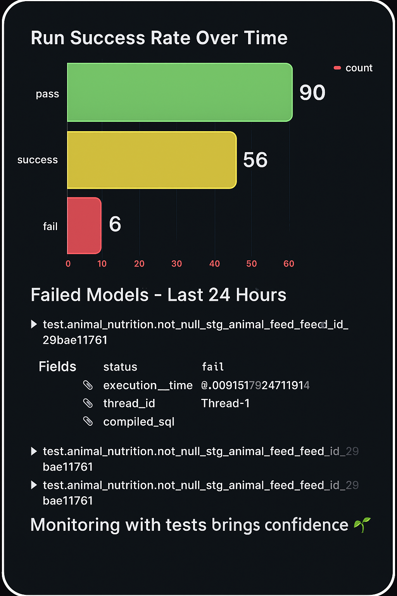
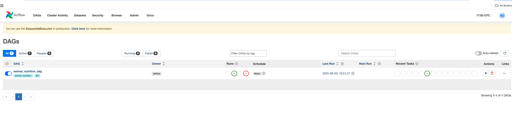
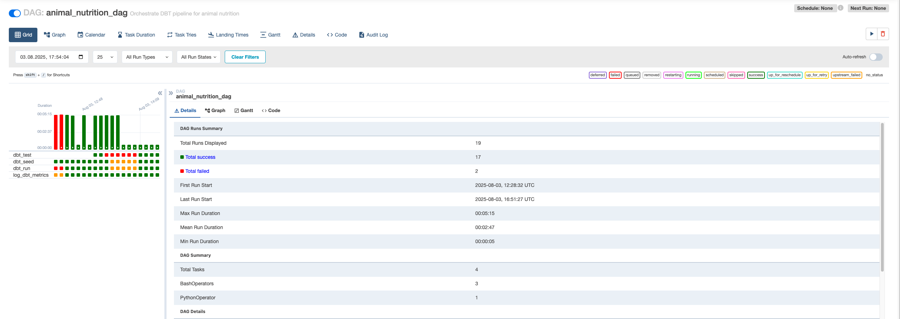
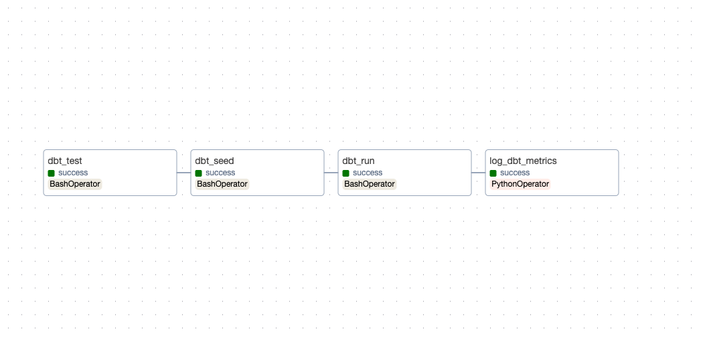
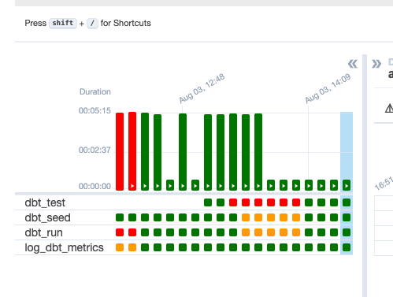

# Designing DataOps Pipelines: A Practical Guide Using Animal Nutrition Data


<p align="center">

</p>
## Project Goals

This project demonstrates how to set up a complete DataOps pipeline using Airflow, dbt, PostgreSQL, and Grafana. The focus is on building a robust, testable, and observable data platform with both technical and business monitoring dashboards. The project uses animal feed and regional data to showcase business use cases in feed efficiency, cost trends, and nutrient balance for various livestock types across regions.

### Why This Project Matters

DataOps remains one of the most challenging areas to implement effectively across data teams. This project is designed for Data Engineers, Lead Data Engineers, and Data Architects who want to understand and adopt core DataOps design principles. It helps bridge the gap between theory and real-world tooling by demonstrating best practices and execution workflows.

### Business Context

The data used in this project represents various animal feed types, associated nutritional values (protein, energy, fiber), costs, and region-specific information such as average rainfall and livestock types. The insights drawn from this data help stakeholders make informed decisions about cost-effective and nutritionally efficient feed strategies.

---

## Learning Objectives

* Understand the lifecycle and principles of DataOps
* Learn how to orchestrate dbt pipelines using Airflow
* Automate dbt testing, seeding, and execution
* Log run metadata and execution metrics in PostgreSQL
* Visualize pipeline health and data quality in Grafana
* Automate workflows with `Makefile`
* Use GitHub CI/CD and GitLab CI/CD for version-controlled deployments

---

## Project Structure

The project is based on the GitHub repository: [AnimalNutriOps](https://github.com/ankit-khare-2015/AnimalNutriOps)

```
📦 animal_nutrition_project/
├── dags/                        # Airflow DAGs
├── dbt/                         # dbt project (models, seeds, macros, tests)
│   ├── models/
│   ├── seeds/
│   ├── macros/
│   └── schema.yml
├── .github/workflows/          # GitHub Actions CI/CD for dbt
├── .gitlab-ci.yml              # GitLab CI/CD configuration
├── docker-compose.yml          # Services setup
├── Makefile                    # Automation commands
├── grafana_dashboards/         # JSON dashboards
└── README.md                   # Project overview
```

---

## DataOps Principles and Tool Mapping

DataOps is the application of Agile and DevOps principles to data pipelines. It ensures faster, reliable, and collaborative data delivery.

| Principle       | Tool/Component                                | Description                                 |
| --------------- | --------------------------------------------- | ------------------------------------------- |
| Reproducibility | dbt, Docker                                   | Ensures consistency across environments     |
| Observability   | Grafana, dbt\_run\_log                        | Enables monitoring of model runs and errors |
| Modularity      | dbt models, Airflow DAGs                      | Separates logic for reuse and clarity       |
| Automation      | Makefile, Airflow, GitHub CI/CD, GitLab CI/CD | Minimizes manual interventions              |
| Version Control | GitHub, GitLab Pipelines                      | Tracks all changes and supports rollback    |

---

## Architecture Overview

```
                 ┌────────────────────────┐
                 │      Source Data       │
                 └──────────┬─────────────┘
                            ↓
                   ┌──────────────┐
                   │   Airflow    │ (Scheduler/Orchestrator)
                   └────────┬─────┘
                            ↓
      ┌─────────────┐   ┌───────────────┐   ┌───────────────┐
      │ dbt Seed    │→→ │ dbt Run       │→→ │ dbt Test      │
      └─────────────┘   └───────────────┘   └───────────────┘
                            ↓
                  ┌────────────────────────┐
                  │    PostgreSQL (DW)     │
                  └────────────┬───────────┘
                               ↓
                     ┌────────────────┐
                     │   Grafana      │
                     └────────────────┘
```

---
## Makefile Overview

The Makefile simplifies Docker command execution for this project. Run `make help` to see available commands and their descriptions.  
**Note:** Use the `prune` command with caution, as it will remove all unused Docker volumes and images.

| Command        | Description                       |
| -------------- | --------------------------------- |
| `make up`      | Start all Docker services         |
| `make down`    | Stop all services                 |
| `make init`    | DB migration for Airflow metadata |
| `make user`    | Create admin user for Airflow     |
| `make logs`    | View Docker logs                  |
| `make prune`   | Clean up unused Docker volumes    |
| `make rebuild` | Rebuild containers without cache  |


## Execution Steps

### 1. Clone and Start the Project

```bash
git clone https://github.com/ankit-khare-2015/DataOps-Animal-Nutrition.git
cd DataOps-Animal-Nutrition
make up
```

### 2. Create Airflow User

```bash
make user
```

### 3. Access Airflow UI

* Navigate to `http://localhost:8080`
* Login with `airflow / airflow`
* Trigger `animal_nutrition_dag`
<p align="center">
  
  
  
  
</p>

### 4. Access Grafana
* Navigate to `http://localhost:3000/`
* Login with admin/admin
* Test the datasource connection 
* View the existing report **Data Pipeline Run History & Audit Log Purpose**

---
## Monitoring Dashboards

| Dashboard Name            | Description                              |
| ------------------------- | ---------------------------------------- |
| Pipeline Health Dashboard | Tracks run time, model status, row count |
| Model Execution Trend     | Shows historical performance of models   |
| Data Quality Overview     | Visualizes dbt test results and trends   |

---

## Seed Data and dbt Data Model

Seed files are found in `dbt/seeds/` and include data like feed type, price, and nutrient metrics.

### Key Tables and Fields

* **stg\_animal\_feed**:

  * feed\_id, animal\_type, feed\_name
  * protein, energy, fiber
  * price\_per\_kg, region, date

* **dim\_region**:

  * region, avg\_rainfall\_mm, main\_livestock, climate\_zone

* **mart\_avg\_price\_by\_region**:

  * region, avg\_price\_per\_kg

* **mart\_feed\_cost\_efficiency**:

  * feed\_name, protein\_per\_dollar, energy\_per\_dollar

* **mart\_nutrient\_summary**:

  * animal\_type, avg\_protein, avg\_energy, avg\_fiber

Here is a simple schema diagram based on the tables and data you've shared. It reflects the **DataOps pipeline layers** — from **Seed Data → Staging → Marts → Audit Tables**, with appropriate relationships and column examples for each layer.

---

### 🗂️ **Schema Overview**

```text
         ┌────────────────────────────┐
         │        Seed Layer          │
         └────────────────────────────┘
            ↓                    ↓
┌────────────────────┐     ┌──────────────────────┐
│  seed_animal_feed  │     │ seed_region_profiles │
│────────────────────│     │──────────────────────│
│ feed_id            │     │ region               │
│ animal_type        │     │ avg_rainfall_mm      │
│ feed_name          │     │ main_livestock       │
│ protein            │     │ climate_zone         │
│ energy             │     └──────────────────────┘
│ fiber              │
│ price_per_kg       │
│ region             │
│ date               │
└────────────────────┘
            ↓
         (Transform)

         ┌────────────────────────────┐
         │        Staging Layer       │
         └────────────────────────────┘
                ↓
       ┌─────────────────────────────┐
       │     stg_animal_feed         │ ← cleaned/transformed
       └─────────────────────────────┘
       │ feed_id, animal_type, ...   │
       └─────────────────────────────┘
                ↓ (joins/aggregates)
       ┌──────────────────────────────────────┐
       │             Mart Layer               │
       └──────────────────────────────────────┘
  ┌────────────────────┬──────────────────────────────┬───────────────────────────┐
  │ mart_avg_price_by_ │ mart_feed_cost_efficiency    │ mart_nutrient_summary     │
  │ region             │                              │                           │
  │────────────────────│──────────────────────────────│───────────────────────────│
  │ region             │ feed_id, feed_name, region,  │ animal_type, avg_protein, │
  │ avg_price_per_kg   │ protein_per_dollar, energy_  │ avg_energy, avg_fiber     │
  │                    │ per_dollar                   │                           │
  └────────────────────┴──────────────────────────────┴───────────────────────────┘
                                ↓
         ┌─────────────────────────────────┐
         │         Audit Layer             │
         └─────────────────────────────────┘
         │ audit_feed_data_volume          │
         │─────────────────────────────────│
         │ audit_date, row_count           │
         └─────────────────────────────────┘
```

---

### 💡 Relationships Summary

| From Table             | To Table                 | Relationship                            |
| ---------------------- | ------------------------ | --------------------------------------- |
| `seed_animal_feed`     | `stg_animal_feed`        | Direct transformation                   |
| `seed_region_profiles` | `dim_region`             | 1:1 mapping (can also be reference dim) |
| `stg_animal_feed`      | `mart_*` tables          | Used for aggregations and metrics       |
| `stg_animal_feed`      | `audit_feed_data_volume` | Used to track daily load row count      |


---

## Bonus Section: Business Dashboards

| Dashboard Name               | Description                                  |
| ---------------------------- | -------------------------------------------- |
| Feed Price by Region         | Region-wise average price of feed            |
| Top Efficient Feed by Type   | Ranking by protein and energy per dollar     |
| Nutrient Summary by Animal   | Avg protein, energy, and fiber by animal     |
| Feed Cost vs Nutrient Output | Tradeoff comparison between price and output |
| Feed Type Usage Trends       | Historical trends by animal and region       |

📸 *Placeholder for Screenshot*: *Business KPI dashboards*

---

## Reference: Airflow Operators

### Bash Operator

```python
BashOperator(
  task_id='run_dbt_test',
  bash_command='dbt test --project-dir /opt/airflow/dbt',
  dag=dag
)
```

### Python Operator

```python
def push_metrics():
  # Connect to DB and insert custom metric rows

PythonOperator(
  task_id='log_metrics',
  python_callable=push_metrics,
  dag=dag
)
```

---

## Common Issues Faced

* **Git errors**: Minimal dbt debug mode to bypass unnecessary checks
* **Test failures**: Validate `dbt test` data and assertions
* **Missing log tables**: Ensure macros and SQL for logging are executed
* **Airflow bash errors**: Validate dependency installation and environment paths

---

## Next Steps

* Add Great Expectations for advanced validation
* Configure alerting and anomaly detection
* Add Data Version with tools like nessie


---

## 📚 References & Learning Resources

| Topic                                              | Resource                                                                                                                                             |
| -------------------------------------------------- | ---------------------------------------------------------------------------------------------------------------------------------------------------- |
| **Apache Airflow**                                 | [Airflow Documentation](https://airflow.apache.org/docs/apache-airflow/stable/index.html) <br> [Astronomer Learn](https://www.astronomer.io/guides/) |
| **dbt (Data Build Tool)**                          | [dbt Docs](https://docs.getdbt.com/) <br> [Learn dbt - Official Courses](https://learn.getdbt.com/)                                                  |
| **GitLab CI/CD**                                   | [GitLab CI/CD Pipelines Guide](https://docs.gitlab.com/ee/ci/)                                                                                       |
| **GitHub Actions**                                 | [GitHub Actions Docs](https://docs.github.com/en/actions)                                                                                            |
| **Versioned Data with Nessie**                     | [Project Nessie GitHub](https://github.com/projectnessie/nessie)                                |
| **PostgreSQL**                                     | [PostgreSQL Tutorial](https://www.postgresqltutorial.com/)                                                                                           |
| **Grafana Dashboards**                             | [Grafana Docs](https://grafana.com/docs/grafana/latest/)                                                                                             |
| **Great Expectations** *(optional for next steps)* | [Great Expectations Docs](https://docs.greatexpectations.io/)                                                                                        |
